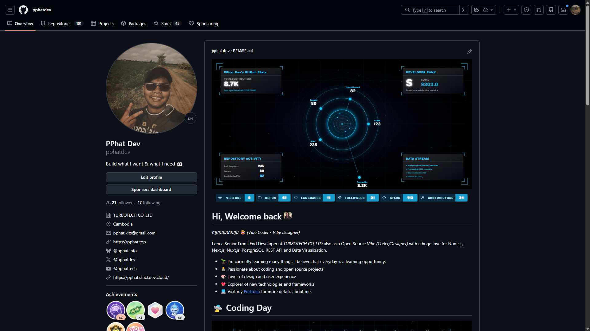

<!--  -->


<div align="center" style="margin-top: 20px;">


</div>

<h1 align="center">Fast GitHub Stats Graph 🚀</h1>

Create beautiful, real-time GitHub stats cards, badges, and contribution graphs that are easy to customize and perfect for your profile README or project docs.

## Endpoints

### `GET /stats`

Returns an SVG Statistic card or pie chart for a user.

Example:

```
GET https://stats.pphat.top/stats?username=pphatdev
```
Required query params:

- username

Optional query params:

| Param | Description |
|-------|-------------|
| `theme` | Theme preset |
| `hide_title` | Hide title (`true`/`false`) |
| `hide_border` | Hide border (`true`/`false`) |
| `hide_rank` | Hide rank (`true`/`false`) |
| `show_icons` | Show icons (`true`/`false`) |
| `avatar_mode` | Avatar mode: `none` / `avatar` / `radar` |
| `show_avatar` | Legacy alias; `true` sets `avatar_mode=avatar` |
| `custom_title` | Custom card title |
| `data_border_style` | Border style: `solid` / `frame` |
| `data_border_frame` | Border frame position: `in` / `out` |
| `bgColor` | Background color |
| `borderColor` | Border color |
| `textColor` | Text color |
| `titleColor` | Title color |
| `format` | Output format: `svg` / `webp` |

Example:


```
GET https://stats.pphat.top/stats?username=pphatdev&avatar_mode=radar
```

### `GET /languages`

Returns an SVG languages card or pie chart for a user.

Required query params:

- username

Optional query params:

| Param | Description |
|-------|-------------|
| `theme` | Theme preset |
| `show_info` | Show extra language info |
| `top` | Limit number of top languages |
| `variant` | Card variant style |
| `type` | Output style: `card` / `pie` |
| `bgColor` | Background color |
| `borderColor` | Border color |
| `textColor` | Text color |
| `titleColor` | Title color |
| `format` | Output format |

Example:


```
GET https://stats.pphat.top/languages?username=pphatdev
```

### `GET /graph`

Returns an SVG activity graph for a user for a specific year or the last 365 days.

Required query params:

- `username`

Optional query params:

| Param | Description |
|-------|-------------|
| `theme` | Theme preset (see [Graph Themes](#graph-themes)) |
| `year` | 4-digit year (default: last 365 days) |
| `animate` | Animation mode: `glow` (default), `wave`, `pulse`, `none` |
| `size` | Canvas preset: `default`, `small`, `medium`, `large` |
| `show_title` | Show/hide username + year heading |
| `show_total_contribution` | Show/hide contribution subtitle |
| `show_background` | Show/hide background gradient, stars, and grid |
| `as` | Output format: `svg` (default), `gif`, `webp`, `png` |
| `bgColor` | Background color |
| `borderColor` | Border color |
| `textColor` | Text color |
| `titleColor` | Title color |

Example:


```
GET https://stats.pphat.top/graph?username=pphatdev&year=2024
GET https://stats.pphat.top/graph?username=pphatdev&theme=aurora
GET https://stats.pphat.top/graph?username=pphatdev&theme=matrix&animate=pulse
GET https://stats.pphat.top/graph?username=pphatdev&theme=ocean&animate=wave
GET https://stats.pphat.top/graph?username=pphatdev&theme=aurora&animate=wave&as=gif
GET https://stats.pphat.top/graph?username=pphatdev&theme=matrix&animate=pulse&as=webp
GET https://stats.pphat.top/graph?username=pphatdev&as=png
```

### `GET /icons` and `GET /icons/:name`

Provides reusable SVG icons: list all icon names, fetch an icon by name, and preview the icon gallery demo page.

Routes:

- `/icons` - Returns JSON list of available icons
- `/icons/:name` - Returns icon SVG by name (e.g. `/icons/react`)
- `/icons/:name.svg` - Same as above with explicit extension
- `/icons/demo` - Interactive icons demo page

Optional query params for `/icons/:name`:

| Param | Description |
|-------|-------------|
| `color` | Replaces `currentColor` values in icon fill/stroke |
| `foreground` | Recolors elements marked with `data-foreground` |
| `glow` | Enable glow effect (`true` or `1`) |
| `glowColor` | Set glow color (hex, rgb, named color). Defaults to `#00AAFF` |

Examples:

```text
GET https://stats.pphat.top/icons
GET https://stats.pphat.top/icons/react
GET https://stats.pphat.top/icons/react.svg
GET https://stats.pphat.top/icons/typescript?color=%23FF0000
GET https://stats.pphat.top/icons/html?foreground=%230088CC
GET https://stats.pphat.top/icons/react?color=%230088CC&foreground=%23FF0000
GET https://stats.pphat.top/icons/react?glow=true
GET https://stats.pphat.top/icons/typescript?glow=true&glowColor=%23FF00FF
GET https://stats.pphat.top/icons/github?glow=true&glowColor=blue
GET https://stats.pphat.top/icons/react?color=%230088CC&glow=true&glowColor=%2300FF00
GET https://stats.pphat.top/icons/demo
```

### `GET /badge/:type`

Returns dynamic badge SVGs for various GitHub user metrics.

**Available badge types:**

| Endpoint | Description |
|----------|-------------|
| `/badge/visitors` | Visitor counter (increments per unique IP/day) |
| `/badge/repositories` | Total public repositories |
| `/badge/organization` | Organizations count |
| `/badge/languages` | Number of programming languages used |
| `/badge/followers` | Follower count |
| `/badge/total-stars` | Total stars across all repositories |
| `/badge/total-contributors` | Total contributors |
| `/badge/total-commits` | Total commits |
| `/badge/total-code-reviews` | Total code reviews |
| `/badge/total-issues` | Total issues created |
| `/badge/total-pull-requests` | Total pull requests |
| `/badge/total-joined-years` | Years since joining GitHub |

Required query params:

- `username`

Optional query params:

| Param | Description |
|-------|-------------|
| `theme` | Badge theme: `default`, `aurora`, `matrix`, `inferno`, `ocean`, `neon`, `solar`, `galaxy`, `github-dark` |
| `customLabel` | Override label text |
| `labelColor` | Label text color (hex without `#`, e.g. `ff5733`) |
| `labelBackground` | Label background color (hex without `#`) |
| `iconColor` | Icon color (hex without `#`) |
| `valueColor` | Value text color (hex without `#`) |
| `valueBackground` | Value background color (hex without `#`) |
| `hideFrame` | Hide corner bracket frame (`true`/`false`, default `false`) |
| `hideIcon` | Hide badge icon (`true`/`false`, default `false`) |

Examples:


```
GET https://stats.pphat.top/badge/visitors?username=pphatdev
GET https://stats.pphat.top/badge/total-stars?username=pphatdev&theme=ocean
GET https://stats.pphat.top/badge/repositories?username=pphatdev&hideFrame=true
GET https://stats.pphat.top/badge/followers?username=pphatdev&hideIcon=true&theme=neon
GET https://stats.pphat.top/badge/total-commits?username=pphatdev&hideFrame=true&hideIcon=true
```

### `GET /project/:type`

Returns dynamic badge SVGs for repository/project-specific metrics.

**Available project badge types:**

| Endpoint | Description |
|----------|-------------|
| `/project/stars` | Repository star count |
| `/project/forks` | Repository fork count |
| `/project/watchers` | Repository watcher count |
| `/project/issues` | Open issues count |
| `/project/prs` | Open pull requests count |
| `/project/contributors` | Contributors count |
| `/project/size` | Repository size |

Required query params:

- `repo` — Repository in format `owner/repo` (e.g., `pphatdev/github-stats`)

Optional query params:

| Param | Description |
|-------|-------------|
| `theme` | Badge theme: `default`, `aurora`, `matrix`, `inferno`, `ocean`, `neon`, `solar`, `galaxy`, `github-dark` |
| `customLabel` | Override label text |
| `labelColor` | Label text color (hex without `#`, e.g. `ff5733`) |
| `labelBackground` | Label background color (hex without `#`) |
| `iconColor` | Icon color (hex without `#`) |
| `valueColor` | Value text color (hex without `#`) |
| `valueBackground` | Value background color (hex without `#`) |
| `hideFrame` | Hide corner bracket frame (`true`/`false`, default `false`) |
| `hideIcon` | Hide badge icon (`true`/`false`, default `false`) |

Examples:


```
GET https://stats.pphat.top/project/stars?repo=pphatdev/github-stats
GET https://stats.pphat.top/project/forks?repo=pphatdev/github-stats&theme=aurora
GET https://stats.pphat.top/project/issues?repo=pphatdev/github-stats&hideFrame=true
GET https://stats.pphat.top/project/contributors?repo=pphatdev/github-stats&hideIcon=true
```

## Usage in README

Stats card:

```markdown

```

Languages card:

```markdown

```

Languages pie chart:

```markdown

```

Activity graph:

```markdown

```

Activity graph with theme and animation:

```markdown

```

Visitor badge:

```markdown

```

Other badges (stars, followers, commits, etc.):

```markdown


```

Badges with theme and custom label:

```markdown


```

Minimal badges (no frame, no icon):

```markdown


```

Badges without frame (clean border):

```markdown


```

Badges without icon (text focus):

```markdown


```

Project/repository badges:

```markdown


```

## Example Themes

Use the `theme` query param. A few previews:

<table>
	<tr>
		<td align="center"><br /><strong>🎨 default</strong></td>
		<td align="center"><br /><strong>🌙 dark</strong></td>
		<td align="center"><br /><strong>⚡ radical</strong></td>
		<td align="center"><br /><strong>🌆 tokyonight</strong></td>
	</tr>
	<tr>
		<td align="center"><br /><strong>🧛 dracula</strong></td>
		<td align="center"><br /><strong>🌈 monokai</strong></td>
		<td align="center"><br /><strong>🍂 gruvbox</strong></td>
		<td align="center"><br /><strong>🖤 onedark</strong></td>
	</tr>
</table>

### All Available Themes (50+)

| Category | Themes |
|----------|--------|
| Dark | `default`, `dark`, `radical`, `merko`, `gruvbox`, `tokyonight`, `onedark`, `cobalt`, `synthwave`, `highcontrast`, `dracula`, `prussian`, `monokai`, `vue`, `vue-dark`, `shades-of-purple`, `nightowl`, `buefy-dark`, `blue-green`, `algolia`, `great-gatsby`, `darcula`, `bear`, `solarized-dark`, `chartreuse-dark`, `nord`, `gotham`, `material-palenight`, `vision-friendly-dark`, `ayu-mirage`, `midnight-purple`, `calm`, `omni`, `react`, `jolly`, `maroongold`, `yeblu`, `blueberry`, `slateorange`, `kacho_ga`, `outrun`, `ocean_dark`, `city_lights`, `github_dark`, `discord_old_blurple`, `aura_dark`, `panda`, `noctis_minimus`, `cobalt2`, `swift`, `aura`, `apprentice`, `moltack`, `codeSTACKr`, `rose_pine` |
| Light | `solarized-light`, `graywhite`, `flag-india` |

Full theme list is in [src/utils/themes](src/utils/themes).

## Graph Themes

These themes are tuned for the `/graph` heatmap card — vivid `iconColor` cells against near-black backgrounds.

<table>
	<tr>
		<td align="center"><br /><strong>🌌 aurora</strong></td>
		<td align="center"><br /><strong>💚 matrix</strong></td>
	</tr>
	<tr>
		<td align="center"><br /><strong>🔥 inferno</strong></td>
		<td align="center"><br /><strong>🌊 ocean</strong></td>
	</tr>
</table>

All available themes: `aurora` · `matrix` · `inferno` · `ocean` · `neon` · `solar` · `galaxy` · `github-dark`

### Animate Modes

| Mode    | Description                                   |
| ------- | --------------------------------------------- |
| `glow`  | Default — active cells pulse with a soft glow |
| `wave`  | Cells ripple in a wave pattern across columns |
| `pulse` | ~16 random cells flash independently          |
| `none`  | No animation — static render                  |

### Size Presets

| Value     | Canvas     | Cell size |
| --------- | ---------- | --------- |
| `default` | 1200 × 600 | 14 px     |
| `small`   | 800 × 400  | 9 px      |
| `medium`  | 1000 × 500 | 12 px     |
| `large`   | 1400 × 700 | 16 px     |

## Development

Development setup was moved to: [docs/how-to/DEVELOPMENT.md](docs/how-to/DEVELOPMENT.md)

Route-by-route demos with option examples: [docs/example/README.md](docs/example/README.md)

## Architecture

- **API**: GitHub REST + GraphQL APIs with intelligent batching
- **Caching**: Multi-tier (Memory → Redis → Source) with 2-hour default TTL
- **Database**: SQLite with Drizzle ORM for badge counters and visitor logs
- **Server**: Express.js with optional cluster mode for multi-core scaling
- **Rendering**: Server-side SVG generation with optional WebP/PNG/GIF export

## Notes

- Responses are cached for 2 hours (configurable via `CACHE_DURATION`)
- Without a GitHub token, API rate limits are very low (~60 requests/hour)
- Set `GITHUB_TOKEN` to get 5,000 requests/hour
- Redis is optional but recommended for production (enables distributed caching)
- Visitor badges use IP hashing for privacy-preserving unique visitor counting

## License

MIT. See LICENSE.

