# Project Structure

This document provides a comprehensive overview of the GitHub Stats project structure and organization.

## Table of Contents

1. [Version](#version)
2. [System Architecture Flow](#system-architecture-flow)
   - [Overall Request Flow](#overall-request-flow)
   - [Module Architecture Flow](#module-architecture-flow)
   - [Caching Strategy Flow](#caching-strategy-flow)
   - [Module Structure Flow](#module-structure-flow)
3. [Root Directory](#root-directory)
   - [Directory Structure Visualization](#directory-structure-visualization)
4. [Source Code Structure](#source-code-src)
   - [Entry Points](#entry-points)
   - [Configuration](#configuration-srcconfig)
   - [Database](#database-srcdb)
   - [Modules](#modules-srcmodules)
   - [Routes](#routes-srcroutes)
   - [Services](#services-srcservices)
   - [Shared](#shared-srcshared)
   - [Views](#views-srcviews)
5. [Public Assets](#public-assets-public)
6. [Documentation](#documentation-docs)
7. [Database Migrations](#database-drizzle)
8. [Scripts](#scripts-scripts)
9. [Tests](#tests-tests)
10. [Configuration Files](#configuration-files)
11. [Architecture Overview](#architecture-overview)
12. [Detailed Flow Diagrams](#detailed-flow-diagrams)
    - [Deployment Architecture](#deployment-architecture)
    - [Service Layer Interaction](#service-layer-interaction)
    - [Error Handling Flow](#error-handling-flow)
    - [Icon Collection Rendering Flow](#icon-collection-rendering-flow)
    - [Badge Collection Rendering Flow](#badge-collection-rendering-flow)
13. [Best Practices](#best-practices)
14. [Development Workflow](#development-workflow)
    - [Development Lifecycle Flow](#development-lifecycle-flow)
    - [Module Creation Workflow](#module-creation-workflow)
15. [Related Documentation](#related-documentation)

## Version

Current Version: **2.1.0**

## System Architecture Flow

### Overall Request Flow

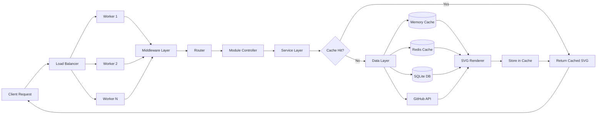

### Module Architecture Flow

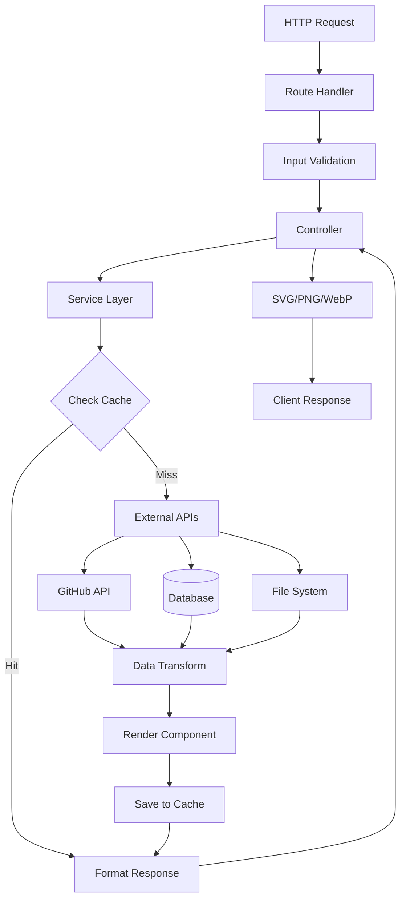

### Caching Strategy Flow

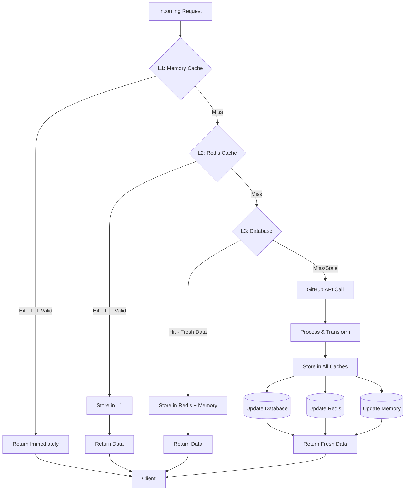

### Module Structure Flow

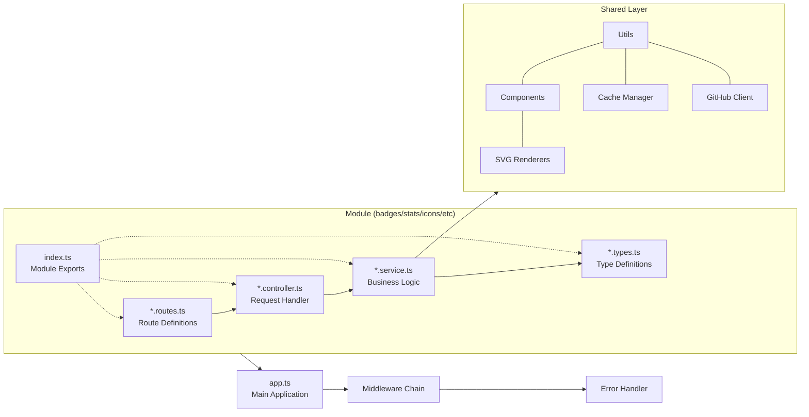

## Root Directory

```
stats.pphat.top/
├── src/                    # Source code
├── public/                 # Static assets
├── docs/                   # Documentation
├── data/                   # Database files
├── drizzle/               # Database migrations
├── scripts/               # Utility scripts
├── tests/                 # Test files
├── package.json           # Project dependencies and scripts
├── tsconfig.json          # TypeScript configuration
├── drizzle.config.ts      # Drizzle ORM configuration
├── wrangler.toml          # Cloudflare Workers configuration
├── ecosystem.config.cjs   # PM2 configuration
└── README.md              # Main documentation
```

### Directory Structure Visualization

```mermaid
graph TD
    Root[stats.pphat.top] --> Src[src/<br/>Source Code]
    Root --> Public[public/<br/>Static Assets]
    Root --> Docs[docs/<br/>Documentation]
    Root --> Data[data/<br/>Database]
    Root --> Drizzle[drizzle/<br/>Migrations]
    Root --> Scripts[scripts/<br/>Utilities]
    Root --> Tests[tests/<br/>Test Files]
    Root --> Config[Config Files<br/>*.json, *.ts, *.toml]
    
    Src --> SrcModules[modules/<br/>Feature Modules]
    Src --> SrcShared[shared/<br/>Shared Code]
    Src --> SrcConfig[config/<br/>Configuration]
    Src --> SrcDB[db/<br/>Database]
    Src --> SrcRoutes[routes/<br/>Routes]
    Src --> SrcServices[services/<br/>Services]
    Src --> SrcViews[views/<br/>UI Views]
    
    SrcModules --> Badges[badges/]
    SrcModules --> Stats[stats/]
    SrcModules --> Graphs[graphs/]
    SrcModules --> Icons[icons/]
    SrcModules --> Languages[languages/]
    SrcModules --> Health[health/]
    
    SrcShared --> Components[components/<br/>Renderers]
    SrcShared --> Utils[utils/<br/>Helpers]
    SrcShared --> Middleware[middlewares/]
    SrcShared --> Errors[errors/]
    SrcShared --> Validations[validations/]
    
    Public --> Assets[assets/icons/]
    Public --> CSS[css/]
    Public --> Fonts[fonts/]
    
    Docs --> HowTo[how-to/<br/>Guides]
    Docs --> Examples[example/<br/>Demos]
    Docs --> Release[RELEASE/]
    
    Tests --> Unit[unit/]
    Tests --> Integration[integration/]
    Tests --> E2E[e2e/]
    
    style Root fill:#4a90e2,color:#fff
    style Src fill:#50c878,color:#fff
    style SrcModules fill:#ff6b6b,color:#fff
    style SrcShared fill:#ffd93d,color:#000
    style Public fill:#a8dadc,color:#000
    style Docs fill:#b392ac,color:#fff
```

## Source Code (`src/`)

### Entry Points

```
src/
├── index.ts              # Main application entry point
├── server.ts             # Single-process server
├── server-cluster.ts     # Multi-core cluster server
├── cluster.ts            # Cluster management utilities
├── worker.ts             # Worker process logic
├── app.ts                # Express app configuration
└── types.ts              # Global TypeScript types
```

### Configuration (`src/config/`)

```
src/config/
├── index.ts              # Configuration exports
├── env.ts                # Environment variables
├── db.ts                 # Database configuration
├── logger.ts             # Logging configuration
└── swagger.ts            # API documentation setup
```

### Database (`src/db/`)

```
src/db/
├── index.ts              # Database exports
├── pool.ts               # Connection pooling
└── schema.ts             # Drizzle schema definitions
```

### Modules (`src/modules/`)

Feature-based modular architecture. Each module follows the same structure:

```
src/modules/
├── badges/               # User badge endpoints
│   ├── index.ts
│   ├── badges.controller.ts
│   ├── badges.routes.ts
│   ├── badges.service.ts
│   └── badges.types.ts
│
├── graphs/               # Contribution graph endpoints
│   ├── index.ts
│   ├── graphs.controller.ts
│   ├── graphs.routes.ts
│   ├── graphs.service.ts
│   └── graphs.types.ts
│
├── health/               # Health check endpoints
│   ├── index.ts
│   ├── health.controller.ts
│   ├── health.routes.ts
│   ├── health.service.ts
│   └── health.types.ts
│
├── icons/                # Icon delivery endpoints
│   ├── index.ts
│   ├── icons.controller.ts
│   ├── icons.routes.ts
│   ├── icons.service.ts
│   └── icons.types.ts
│
├── languages/            # Language statistics endpoints
│   ├── index.ts
│   ├── languages.controller.ts
│   ├── languages.routes.ts
│   ├── languages.service.ts
│   └── languages.types.ts
│
└── stats/                # User statistics endpoints
    ├── index.ts
    ├── stats.controller.ts
    ├── stats.routes.ts
    ├── stats.service.ts
    └── stats.types.ts
```

**Module Pattern:**
- `*.controller.ts` - Request handlers
- `*.routes.ts` - Route definitions
- `*.service.ts` - Business logic
- `*.types.ts` - TypeScript interfaces
- `index.ts` - Module exports

### Routes (`src/routes/`)

```
src/routes/
└── docs.routes.ts        # API documentation routes
```

### Services (`src/services/`)

```
src/services/
├── badge-cache.service.ts    # Badge caching logic
└── base.service.ts           # Base service class
```

### Shared (`src/shared/`)

Reusable components, utilities, and middleware:

```
src/shared/
├── components/           # Reusable UI components
│   ├── badge-renderer.ts
│   ├── card-renderer.ts
│   ├── graph-renderer.ts
│   ├── language-card.ts
│   ├── language-pie-chart.ts
│   └── icons-gallery/
│
├── utils/                # Utility functions
│   ├── index.ts
│   ├── cache.ts
│   ├── cache-middleware.ts
│   ├── badge-cache-manager.ts
│   ├── github-client.ts
│   ├── redis-client.ts
│   ├── global-error.ts
│   ├── sidebar.ts
│   ├── themes.ts
│   └── themes/
│       ├── base.ts
│       ├── badge.ts
│       └── graph.ts
│
├── middlewares/          # Express middleware
├── errors/               # Error handling
├── logs/                 # Logging utilities
├── validations/          # Input validation
├── types/                # Shared TypeScript types
└── constants.ts          # Application constants
```

### Views (`src/views/`)

```
src/views/
└── icons-demo.view.tsx   # Icons gallery demo page
```

## Public Assets (`public/`)

```
public/
├── assets/
│   └── icons/            # SVG icon collection
├── css/
│   ├── main.css
│   └── icons-demo.css
├── fonts/                # Web fonts
├── user/                 # User-specific assets
│   └── pphatdev/
├── icons-demo.js         # Icons demo script
└── sitemap.xml           # Sitemap
```

## Documentation (`docs/`)

```
docs/
├── PROJECT_STRUCTURE.md  # This file
├── collections/
│   └── postman_collection.json
│
├── example/              # Usage examples
│   ├── README.md
│   ├── badge-collection.md
│   ├── badge-user.md
│   ├── graph.md
│   ├── icon-collection.md
│   ├── icons.md
│   ├── languages.md
│   ├── project.md
│   └── stats.md
│
├── how-to/               # Development guides
│   ├── README.md
│   ├── DEVELOPMENT.md
│   ├── CORE_ROUTES.md
│   ├── USER_BADGES.md
│   ├── BADGE_COLLECTIONS.md
│   ├── PROJECT_BADGES.md
│   ├── CACHE_MONITORING.md
│   └── RELEASE/
│
└── RELEASE/              # Release notes
    ├── RELEASE_ICONS.md
    └── RELEASE_v2.0.3.md
```

## Database (`drizzle/`)

```
drizzle/
├── meta/
│   ├── _journal.json
│   ├── 0000_snapshot.json
│   └── 0002_snapshot.json
├── 0000_daily_trish_tilby.sql
├── 0000_supreme_bulldozer.sql
├── 0001_visitor_logs.sql
└── 0002_stats_requests.sql
```

## Scripts (`scripts/`)

```
scripts/
├── clear-redis-cache.ts      # Redis cache management
└── test-performance.sh       # Performance testing
```

## Tests (`tests/`)

```
tests/
├── unit/                 # Unit tests
├── integration/          # Integration tests
└── e2e/                  # End-to-end tests
```

## Configuration Files

| File | Purpose |
|------|---------|
| `package.json` | Dependencies, scripts, and metadata |
| `tsconfig.json` | TypeScript compiler configuration |
| `drizzle.config.ts` | Drizzle ORM and database configuration |
| `wrangler.toml` | Cloudflare Workers deployment config |
| `ecosystem.config.cjs` | PM2 process manager configuration |
| `LICENSE` | MIT License |
| `CODE_OF_CONDUCT.md` | Community guidelines |
| `CONTRIBUTING.md` | Contribution guidelines |
| `README.md` | Main project documentation |

## Architecture Overview

### Technology Stack

- **Runtime**: Node.js 18+
- **Language**: TypeScript
- **Framework**: Express.js
- **Database**: SQLite with Drizzle ORM
- **Cache**: Redis (optional) + in-memory
- **Process Management**: PM2 / Native cluster module

### Design Patterns

1. **Modular Architecture**: Feature-based modules with clear separation of concerns
2. **Layered Architecture**: Controller → Service → Data layers
3. **Dependency Injection**: Services injected into controllers
4. **Caching Strategy**: Multi-tier (Memory → Redis → Database → API)
5. **Error Handling**: Centralized error middleware

### Module Responsibilities

- **Controllers**: Handle HTTP requests/responses, validation
- **Services**: Business logic, external API calls, data transformation
- **Routes**: Define endpoints and middleware chain
- **Types**: TypeScript interfaces and type definitions
- **Shared**: Cross-cutting concerns (logging, caching, utilities)

### Data Flow

```
Request → Middleware → Controller → Service → Cache/DB/GitHub API
                                                ↓
Response ← Renderer ← Transform ← Process ← Data
```

### Caching Strategy

1. **L1 Cache**: In-memory (600-3600s TTL)
2. **L2 Cache**: Redis (1min-2hrs TTL, optional)
3. **L3 Cache**: Database persistence (visitor counts, stats)
4. **Source**: GitHub API (rate-limited)

## Detailed Flow Diagrams

### Deployment Architecture

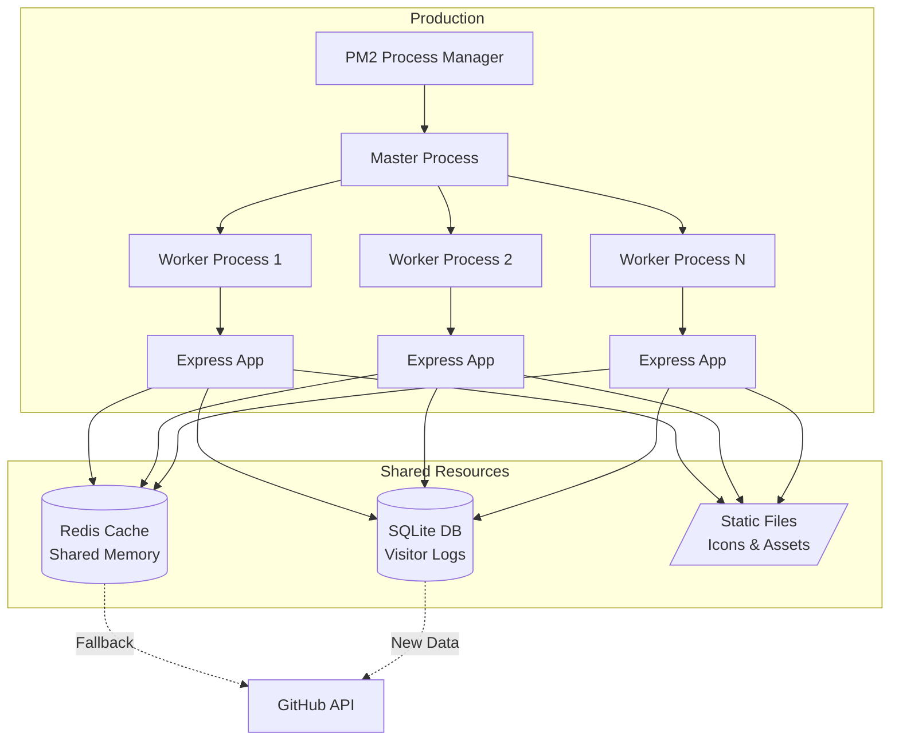

### Service Layer Interaction

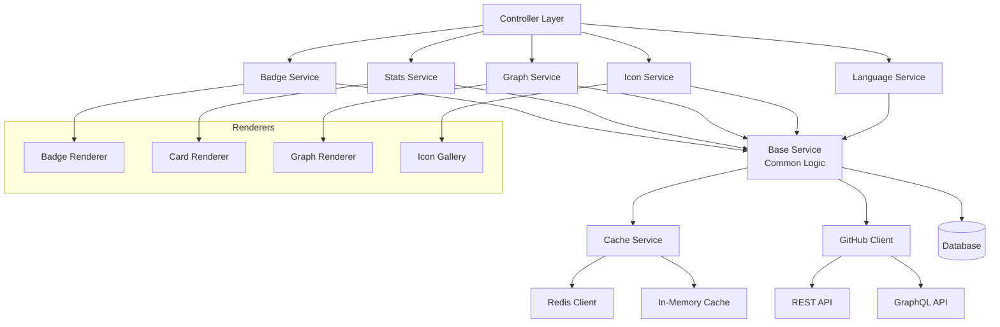

### Error Handling Flow

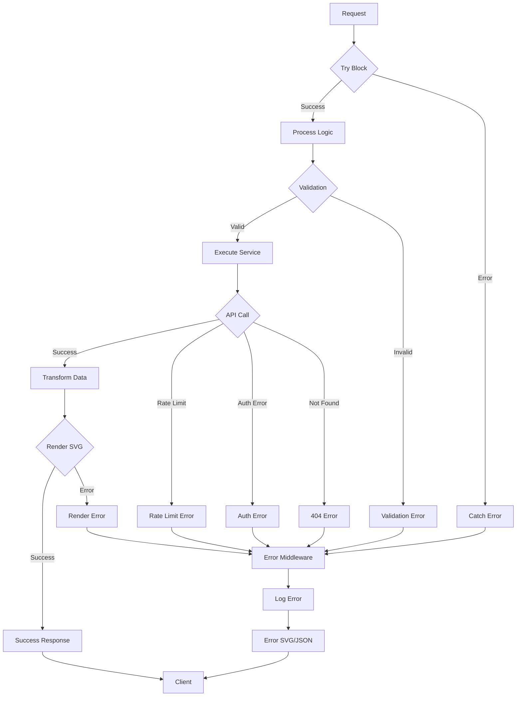

### Icon Collection Rendering Flow

```mermaid
flowchart LR
    Request[Request: icons?name=react,vue,node] --> Parse[Parse Icon Names]
    
    Parse --> Loop[For Each Icon]
    
    Loop --> Check{Icon Exists?}
    Check -->|Yes| Load[Load SVG File]
    Check -->|No| Fallback[Use Fallback Icon]
    
    Load --> Color{Custom Color?}
    Fallback --> Color
    
    Color -->|Yes| Apply[Apply Color Transform]
    Color -->|No| Default[Use Default Color]
    
    Apply --> Effect{Effect Enabled?}
    Default --> Effect
    
    Effect -->|Glow| AddGlow[Add Glow Filter]
    Effect -->|Wave| AddWave[Add Wave Animation]
    Effect -->|None| NoEffect[No Effect]
    
    AddGlow --> Collect[Collect Icons]
    AddWave --> Collect
    NoEffect --> Collect
    
    Collect --> Layout[Calculate Layout<br/>Columns & Gap]
    
    Layout --> Combine[Combine into SVG Grid]
    Combine --> Cache[Cache Result]
    Cache --> Response[Return SVG]
```

### Badge Collection Rendering Flow

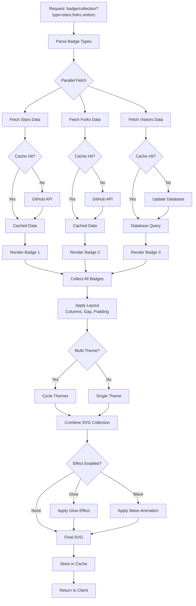

## Best Practices

### Module Creation

When creating a new module:

1. Create folder in `src/modules/{name}/`
2. Add required files: controller, routes, service, types, index
3. Export from index.ts
4. Register routes in main app.ts
5. Add documentation in `docs/how-to/`
6. Add examples in `docs/example/`

### File Naming

- Use kebab-case for files: `badge-renderer.ts`
- Use PascalCase for classes: `class BadgeRenderer`
- Use camelCase for functions: `function renderBadge()`
- Module files: `{module-name}.{type}.ts`

### Import Organization

```typescript
// 1. External dependencies
import express from 'express';

// 2. Config and types
import { config } from '@/config';

// 3. Services
import { BadgeService } from '@/modules/badges';

// 4. Utilities
import { cache } from '@/shared/utils';

// 5. Local imports
import { BadgeOptions } from './badges.types';
```

## Development Workflow

1. **Setup**: Install dependencies and configure environment
2. **Development**: Use `npm run dev` for hot reload
3. **Database**: Run migrations with `npm run db:migrate`
4. **Testing**: Execute tests with `npm test`
5. **Build**: Compile with `npm run build`
6. **Deploy**: Run cluster mode with `npm run start:cluster`

### Development Lifecycle Flow

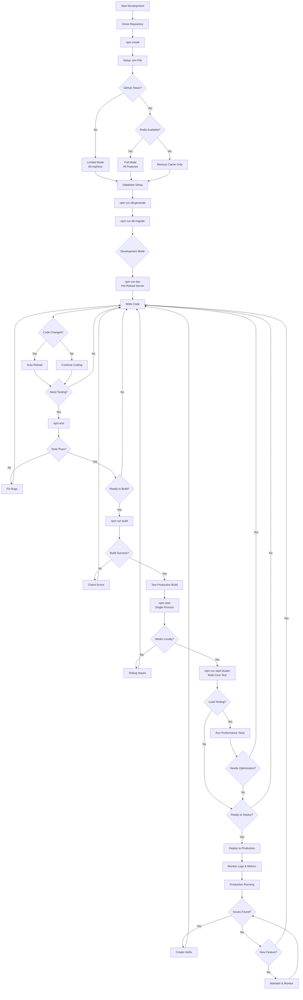

### Module Creation Workflow

```mermaid
flowchart LR
    Start[New Module Request] --> Plan[Plan Module Structure]
    
    Plan --> CreateFolder[Create src/modules/NAME/]
    
    CreateFolder --> CreateFiles[Create Module Files]
    
    CreateFiles --> Types[NAME.types.ts<br/>Interfaces & Types]
    CreateFiles --> Service[NAME.service.ts<br/>Business Logic]
    CreateFiles --> Controller[NAME.controller.ts<br/>Request Handlers]
    CreateFiles --> Routes[NAME.routes.ts<br/>Route Definitions]
    CreateFiles --> Index[index.ts<br/>Module Exports]
    
    Types --> Implement[Implement Logic]
    Service --> Implement
    Controller --> Implement
    Routes --> Implement
    Index --> Implement
    
    Implement --> Register[Register in app.ts]
    
    Register --> Docs[Create Documentation]
    
    Docs --> HowTo[docs/how-to/MODULE.md]
    Docs --> Examples[docs/example/module.md]
    
    HowTo --> Test[Write Tests]
    Examples --> Test
    
    Test --> UnitTests[tests/unit/module.test.ts]
    Test --> IntegrationTests[tests/integration/module.test.ts]
    
    UnitTests --> Run[Run Test Suite]
    IntegrationTests --> Run
    
    Run --> Pass{Tests Pass?}
    
    Pass -->|No| Debug[Debug & Fix]
    Pass -->|Yes| Review[Code Review]
    
    Debug --> Implement
    
    Review --> Approved{Approved?}
    Approved -->|No| Revise[Make Changes]
    Approved -->|Yes| Merge[Merge to Main]
    
    Revise --> Implement
    
    Merge --> Done[Module Complete]
```

## Related Documentation

- [Development Guide](./how-to/DEVELOPMENT.md)
- [Core Routes](./how-to/CORE_ROUTES.md)
- [Contributing Guidelines](../CONTRIBUTING.md)
- [Main README](../README.md)
