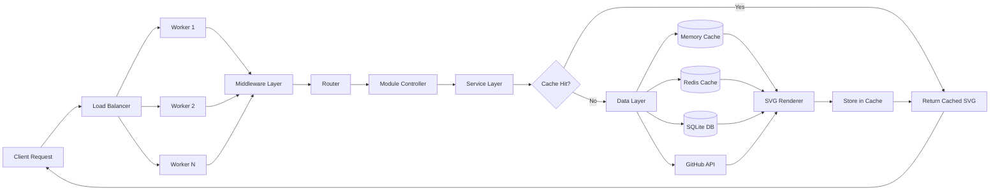
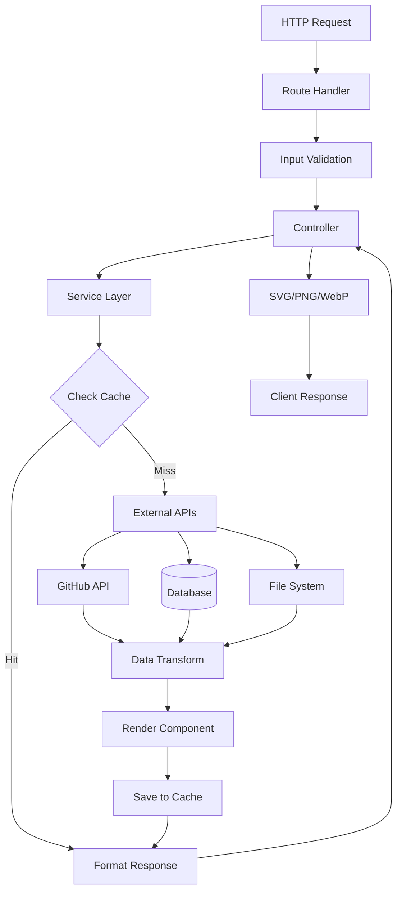
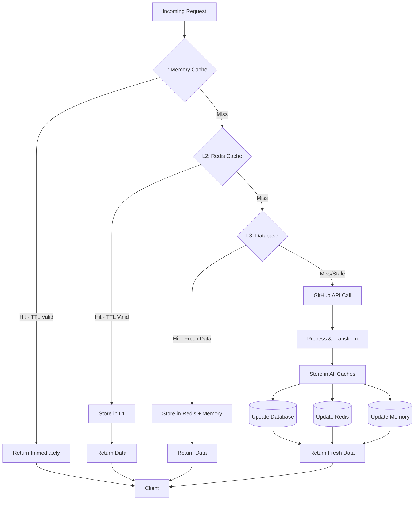

# Project Structure: Overview and Flows

## Version

Current Version: **2.1.1**

## System Architecture Flow

### Overall Request Flow



### Module Architecture Flow



### Caching Strategy Flow



## Architecture Overview

### Technology Stack

- **Runtime**: Node.js 18+
- **Language**: TypeScript
- **Framework**: Express.js
- **Database**: SQLite with Drizzle ORM
- **Cache**: Redis (optional) + in-memory
- **Process Management**: PM2 / Native cluster module

### Data Flow

```text
Request -> Middleware -> Controller -> Service -> Cache/DB/GitHub API
                                                ->
Response <- Renderer <- Transform <- Process <- Data
```
